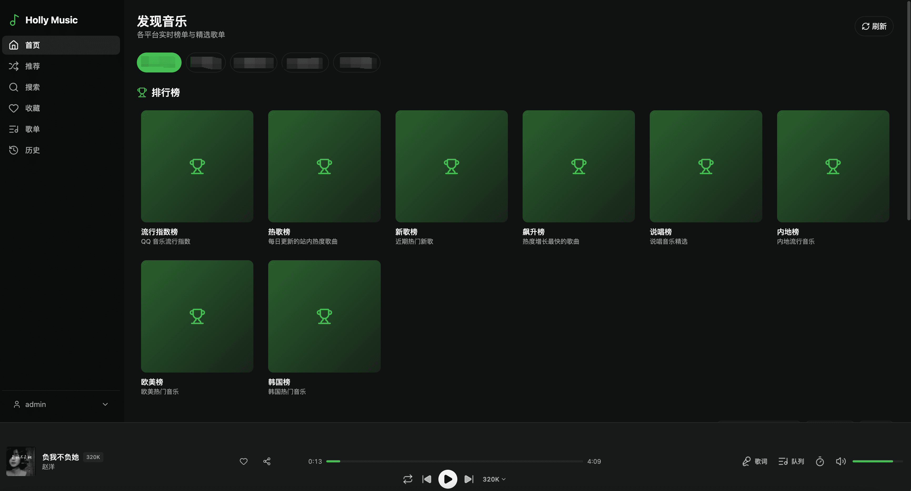
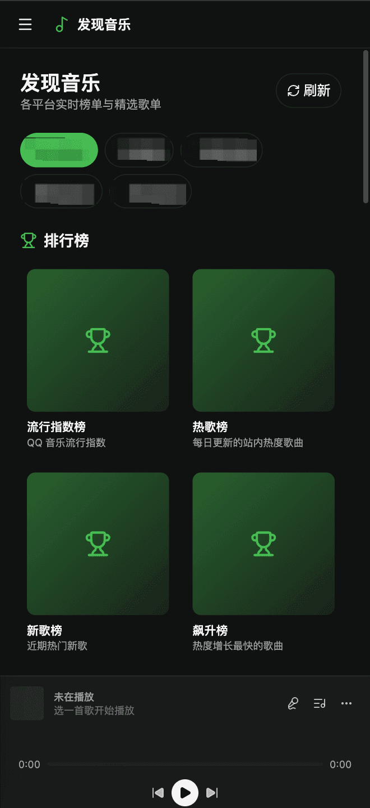
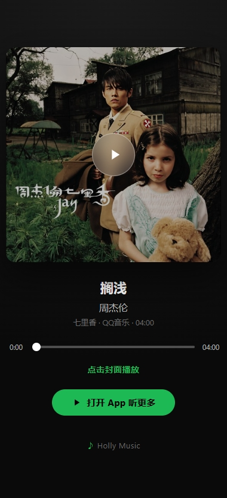

# 🎵 Holly Music

> **直接兼容洛雪（LX Music）自定义音源** · 多源聚合与发现 · 自部署 · PWA

[](LICENSE)
[](https://github.com/redcatH/HollyMusic/pkgs/container/hollymusic)
[](CONTRIBUTING.md)
[](https://github.com/redcatH/HollyMusic/releases)
[](https://github.com/redcatH/HollyMusic/stargazers)
[](#-交流群)

**聚合网络上的一切公开资源，让好音乐触手可及。**

Holly Music 是一个纯自部署的在线音乐聚合播放器。内置 `lx-env-simulator` 兼容层，**可直接加载洛雪音乐（LX Music Desktop）的自定义音源脚本**——你手头已有的洛雪音源 `.js` 丢进来就能用，无需改造。它可聚合多个公开音乐服务的内容，一个搜索框同时检索，质量自动回退（`flac24bit → flac → 320k → 128k`）；发现页还可浏览排行榜与推荐歌单。搜索、播放、收藏、歌单、歌词、下载均在同一套自托管服务中完成。

**🎯 项目初衷**

需求其实很简单：找个能听歌、能随手分享给家人朋友的地方。Holly Music 就是为这件事做的：

- **支持洛雪音源**——洛雪（LX Music）社区有海量现成音源脚本，直接拿来用，不必重新造轮子
- **缓存可控、数据自管**——不保存上游播放地址；可选的音频磁盘缓存用于 Range 播放与断点跳转，并按配额自动清理；收藏 / 歌单 / 历史等用户数据均保存在自己的服务器
- **分享给家人朋友**——一次部署，多人共用，账号各自隔离，互不干扰
- **浏览器打开就能听**——不装客户端、不挑系统，有网就有歌

仅此而已。没有广告、没有社交、不锁设备——把听歌的选择权还给你自己。

**为什么选 Holly Music？**

- 🧩 **洛雪音源生态即插即用**——兼容 LX Music 自定义源 API 2.0.0，社区海量音源脚本直接复用；admin 可上传脚本，或粘贴在线订阅链接导入并手动更新，热重载即时生效
- 🚀 **服务端磁盘缓存 + 边下边播**——音频落盘支持 HTTP Range，seek / 暂停 / 恢复丝滑，多用户共享缓存，LRU 自动清理
- 🌍 **多平台发现内容**——排行榜、推荐歌单与详情页可直接浏览、播放或加入歌单
- 📱 **PWA + 锁屏控制**——安装到主屏像原生 App，断网仍能打开 App Shell，锁屏 / 通知栏 / 耳机线控显示封面与播放控制
- 🔐 **多用户隔离 + 自托管**——收藏、歌单、播放历史按用户隔离，数据在你自己的服务器，签名 Cookie 鉴权
- 🤖 **AI 加持**——管理员可批量跑 AI 推荐任务，用户侧可用自然语言描述需求让 AI 协助建歌单
- 🔌 **Subsonic 协议兼容**——可作为 Subsonic 服务端被 DSub / Ultrasonic 等外部客户端接入

> 💡 **架构一瞥**：前端为 **Vite + React Router** 构建的 SPA（`frontend/`），后端为 **Next.js (App Router)** 仅提供 API（`app/api/`、`app/rest/`）。前端通过 `@/*` 别名复用根目录的 `components/`、`hooks/`、`lib/` 中纯前端部分。详见下文[技术栈](#-技术栈)与[目录结构](#-目录结构)。

## 📋 部署条件

不想读长文？先看这张表，对得上就能跑：

| 维度 | 最低要求 | 说明 |
|------|---------|------|
| **部署方式** | Docker（推荐） | 拉预构建镜像三条命令起服务；也可从源码构建。无 Docker 环境可用 Node.js 18+ + pnpm 本地开发启动 |
| **系统** | 任意能跑 Docker 的系统 | Linux / macOS / Windows 均可；NAS、软路由、小盒子都行 |
| **CPU / 内存** | 1 核 / 512MB 起步 | 纯 Node.js API + nginx，轻量；启用音频磁盘缓存或用户多时建议 1GB+ |
| **磁盘** | 1GB 可用 | 数据库 + 日志几百 MB；音频缓存按 `AUDIO_CACHE_QUOTA_GB` 配置（默认 10GB，可调小） |
| **网络** | 能访问音源上游 | 服务端需能访问各音源接口；客户端只需能访问部署地址。PWA / Service Worker 要求 **HTTPS**（或 localhost） |
| **必填配置** | `AUTH_SECRET` | ≥32 位随机字符串，用于签名登录 Cookie；缺失仅开发环境可用不安全 fallback |
| **可选配置** | `OPENAI_API_KEY` | 启用 AI 推荐任务 / AI 协助建歌单；不填则这两项功能不可用，其余正常 |
| **音源** | 至少一个洛雪音源脚本 | 内置兼容层支持 LX Music 自定义源 API 2.0.0；可 admin 后台上传或手动放入 `custom-sources/`。无音源则搜索/播放无结果 |

> ✅ **一句话门槛**：一台能跑 Docker 的机器 + 一个 `AUTH_SECRET` + 一个洛雪音源脚本，就能跑起来。详细步骤见下文[快速开始](#-快速开始)与 [Docker 部署](#-docker-部署推荐生产)。

---

## ✨ 主要特性

### 🎧 播放体验
- **多源聚合**：一个搜索框，同时检索多个音源，质量回退（`flac24bit → flac → 320k → 128k`）
- **服务端磁盘缓存 + 边下边播**：音频在服务端落盘并支持 HTTP Range，浏览器原生 seek / 暂停 / 恢复；多用户共享缓存，LRU 自动清理；上游不支持 Range 也能正常跳转
- **原生 HTML5 播放引擎**：播放、暂停和切歌带平滑音量渐变；支持的浏览器会在底栏与全屏歌词播放详情显示实时频谱，无法提供 Web Audio 分析数据的浏览器自动保持为空
- **本地精确歌词缓存**：音频完整缓存后，优先按歌曲所属音源的唯一标识获取原生歌词；缓存为与音频同级的 `.lrc`（翻译为 `.tlyric.lrc`），同一歌曲只保存一份，后续优先从本地读取
- **失败自动跳歌**：某首拉取 500 / 解码失败时自动跳下一首，连续失败保护防止死循环
- **音源热重载**：`config/music-sources.json` 变更自动检测 MD5，无需重启
- **一键分享**：当前播放曲目、歌单详情页、歌曲右键菜单均可分享；移动端调起系统原生分享面板（Web Share API），桌面端自动降级为复制链接，打开链接即自动播放 / 加载歌单

### 🌍 多源发现
- **平台切换**：在发现页切换不同公开音乐服务，不依赖已配置的自定义搜索音源
- **排行榜与推荐歌单**：查看各音源榜单、推荐歌单与曲目详情；可直接播放、加入播放队列或保存到自己的歌单

### 📱 移动端 & PWA
- **响应式布局**：大屏侧边栏常驻，小屏自动切换顶部导航栏 + 抽屉式菜单
- **PWA 可安装**：添加到主屏幕，像原生 App 一样打开（无浏览器地址栏）
- **Service Worker 离线壳**：断网时 App Shell 仍能打开
- **Media Session 锁屏控制**：锁屏 / 通知栏 / 耳机线控显示歌名、歌手、封面 + 播放/暂停/上下首按钮
- **刘海屏安全区适配**：`env(safe-area-inset-*)` + `viewport-fit=cover`，全面屏不遮挡按钮
- **歌词沉浸布局**：全屏歌词页，顶部极简下拉箭头 + 底部迷你播放条

### 🔐 用户系统
- **多用户隔离**：收藏、歌单、播放历史按用户隔离
- **用户管理**（仅 admin）：新增 / 编辑 / 删除用户，admin 账户与当前登录用户受保护
- **签名 Cookie 鉴权**：HMAC-SHA256 签名，防伪造

### 🤖 AI 功能
- **管理员 AI 推荐任务**（后台 `/admin/recommend`）：批量按歌手/歌曲跑 AI 筛选写入推荐白名单，多任务排队串行执行，实时进度；支持**重跑**（可改参数）、**取消**、**删除**，已完成的任务支持**回滚**（把该任务推荐的歌曲一键还原为不推荐）
- **AI 协助建歌单**（用户侧 `/playlists` →「AI 建歌单」）：描述需求 → AI 生成候选 → **多源聚合搜索**真实歌曲（可勾选参与搜索的音源，遍历勾选音源全部命中原样收集，版本去重交由 AI）→ AI 过滤多版本（严格按指定数目、绝不重复）→ 用户确认 → 创建歌单。强制使用服务端 `OPENAI_API_KEY`，不向用户暴露

### 🔧 工程能力
- **内存缓存**：搜索结果与播放 URL 缓存（默认 TTL 210 分钟）
- **Subsonic 协议兼容**：通过 `/rest/[method]` 作为 Subsonic 服务端被外部客户端访问，覆盖搜索、随机歌曲、最近播放、收藏、歌单及歌单曲目等常用能力
- **Docker 一键部署**：多阶段构建（前端 SPA + Next.js API + nginx 运行时），含 Prisma 自动迁移

---

## 📸 界面预览

<p align="center">
  
</p>

<p align="center">
   
</p>

---

## 🛠 技术栈

| 层 | 技术 |
|------|------|
| 前端 | Vite 6 + React 19 + React Router v7 + TypeScript 5 |
| 后端 | Next.js 16 (App Router, 仅 API 路由) |
| 样式 | Tailwind CSS v4 |
| 状态 | Zustand |
| 音频 | HTML5 Audio + Web Audio API（频谱）+ 服务端 Range 代理 |
| 数据库 | Prisma + SQLite |
| PWA | Service Worker + Web App Manifest + Media Session API |
| 部署 | Docker / Docker Compose（nginx 托管 SPA + 反代 API） |

---

## 📂 目录结构

```
├── app/                        # Next.js 后端（仅 API，无页面）
│   ├── api/                    # REST API（auth/audio/music-url/lyrics/admin...）
│   │   ├── admin/              # admin 专属（users / login-locks / sources / cache；含在线音源订阅）
│   │   ├── audio/              # 音频流 serve（磁盘缓存 + Range）
│   │   ├── auth/               # 登录/登出/会话/改密
│   │   ├── cover/[id]/         # 封面代理
│   │   ├── download/           # 下载代理（需登录）
│   │   ├── favorites/          # 收藏（含 /check）
│   │   ├── health/             # 健康检查
│   │   ├── discover/           # 多平台排行榜、推荐歌单与详情
│   │   ├── history/            # 播放历史
│   │   ├── lyrics/             # 歌词
│   │   ├── music-url/          # 获取播放地址
│   │   ├── playlists/[id]/     # 歌单 CRUD（含 /songs 子路由）
│   │   ├── proxy/[...path]/    # 通用流式代理
│   │   ├── random/             # 随机推荐
│   │   └── search/             # 搜索
│   └── rest/[method]/          # Subsonic 协议入口
├── frontend/                   # 前端 SPA（Vite + React Router）
│   ├── src/
│   │   ├── routes/             # 页面（Home/Search/Favorites/History/Playlists/Admin...）
│   │   ├── components/         # 前端专属组件
│   │   ├── App.tsx             # 路由根
│   │   └── main.tsx            # SPA 入口
│   ├── public/                 # 前端静态资源（图标/manifest/sw.js）
│   ├── vite.config.ts          # @ → 根目录，@@ → src；dev 代理 /api → 3000
│   └── package.json
├── components/                 # 共享 UI 组件（前端通过 @/ 引用）
│   ├── layout/                 # 布局（AppShell/Sidebar/MobileHeader）
│   ├── player/                 # 播放器（含 AudioSpectrum 实时频谱）
│   ├── shared/                 # 通用组件（CoverImage/SongRow/LoadingSkeleton...）
│   └── playlists/              # 歌单管理弹窗
├── hooks/                      # React Hooks（前端通过 @/ 引用）
│   ├── useAudioPlayer.ts       # 原生 HTML5 Audio 引擎（服务端 Range 代理）
│   ├── useMediaSession.ts      # 锁屏媒体控制
│   ├── useDownload.ts          # 下载（带进度）
│   ├── useSearch.ts            # 搜索
│   ├── useLyrics.ts            # 歌词
│   ├── useRandomSongs.ts       # 发现音乐（带 TTL 缓存）
│   ├── usePlaylists.ts         # 歌单
│   ├── usePlaylistDetail.ts    # 歌单详情
│   ├── usePlayHistory.ts       # 播放历史
│   └── useAuth.ts              # 鉴权
├── lib/                        # 业务核心
│   ├── services/               # 服务层（auth/user-service/playlist-service/discovery/lyrics...）
│   ├── store/                  # Zustand stores（player/favorites/discover/search）
│   ├── api/                    # 前端 API 客户端
│   ├── music-source-manager.ts # 音源管理与热重载
│   ├── cache-manager.ts        # 内存缓存
│   ├── server/lyric-cache.ts   # 音频同级 .lrc 歌词边车文件
│   ├── subsonic*.ts            # Subsonic 协议实现
│   └── logger.ts               # 日志
├── custom-sources/             # 自定义音源脚本（见下文）
├── config/
│   ├── music-sources.json      # 音源注册表
│   └── users.json              # 初始用户（默认 admin）
├── prisma/                     # Prisma schema 与 migrations
├── scripts/                    # 容器启动脚本（start.sh / start-spa.sh）
├── nginx-spa.conf              # Docker 运行时 nginx 配置
├── Dockerfile                  # 三阶段构建（frontend-builder / backend-builder / 运行时）
└── lx-env-simulator/           # 兼容层（慎改）
```

---

## 📚 更多文档

| 文档 | 说明 |
|------|------|
| [音源配置热重载](docs/CONFIG-HOT-RELOAD.md) | `MusicSourceManager` 的配置监听与热重载机制 |
| [VS Code 调试指南](docs/DEBUG-GUIDE.md) | 如何在 VS Code 中调试 Next.js API 端点 |

---

## 🚀 快速开始

### 环境要求
- Node.js 18+
- pnpm（推荐）或 npm

### 1. 安装依赖

根目录与前端各需安装：

```bash
pnpm install
cd frontend && pnpm install && cd ..
```

### 2. 配置环境变量

在项目根创建 `.env`（可复制 `.env.example`）：

```env
DATABASE_URL=file:./prisma/data/music.db

# 鉴权密钥（生产必填，缺失时仅开发环境可用不安全 fallback）
# 生成：openssl rand -hex 32 或 node -e "console.log(require('crypto').randomBytes(32).toString('hex'))"
AUTH_SECRET=请替换为至少32位的随机字符串

# 音频磁盘缓存（服务端 Range 代理 + 边下边播）
ENABLE_FILE_CACHE=true
AUDIO_CACHE_QUOTA_GB=10
AUDIO_CACHE_MAX_CONCURRENT=5
# AUDIO_CACHE_DIR=/app/.cache/audio-cache   # Docker 建议
# 完整变量见 .env.example

# 可选：搜索/URL 内存缓存 TTL（默认 210 分钟）
# SEARCH_CACHE_TTL_MS=12600000
```

### 3. 初始化数据库

```bash
# 首次开发：创建 migration 并生成本地 db
npx prisma migrate dev --name init

# 或快速同步 schema（不生成 migration 文件）
npx prisma db push

# 生成 Prisma Client（migrate 会自动生成，必要时手动执行）
npx prisma generate
```

> ⚠️ **拉取新代码后，本地启动前务必同步 DB schema**：
> ```bash
> npx prisma migrate dev     # 应用未执行的 migration（推荐）
> # 或 npx prisma db push    # 直接把 schema 推到本地 db（不记 migration 历史）
> ```
> 若本地 db 落后于代码 schema（如新增了列），Prisma 全量列查询会抛错并被 service 层 catch，导致 `/api/cover` 等接口**静默回退默认值**（封面全变默认图），且只在服务端日志报错、前端无感知。可用 `npx prisma migrate status` 检查是否有未应用的 migration。

### 4. 启动开发服务器

同时启动 Next.js API（3000）与 Vite 前端（5173）：

```bash
pnpm dev:all
```

- 前端：http://localhost:5173 （Vite dev server，自动代理 `/api` → 3000）
- 后端 API：http://localhost:3000

> 也可单独启动：`pnpm dev`（仅后端）、`pnpm dev:web`（仅前端，需后端在 3000 端口）

> **默认管理员**：`config/users.json` 默认提供 `admin / admin` 账号。首次启动时若检测到该弱口令，会自动改用随机密码（打印在容器日志中，仅显示一次）并强制首次登录改密；admin 用户名固定为 `admin`。用户通过 Web UI 改密后以数据库为准，重启容器不会回写覆盖。

---

## 🐳 Docker 部署（推荐生产）

提供两种方式：**拉预构建镜像**（推荐，无需源码）或**从源码构建**。

### 方式一：拉取预构建镜像（推荐，最快）

镜像通过 GitHub Actions 自动构建并推送至 ghcr.io，无需 clone 源码，三条命令即可跑起来。

**1. 创建部署目录并进入**

```bash
mkdir holly-music && cd holly-music
```

**2. 创建 `docker-compose.yml`**

直接下载仓库自带的示例文件（使用 ghcr.io 预构建镜像，各配置项说明见文件内注释）：

```bash
curl -o docker-compose.yml \
  https://raw.githubusercontent.com/redcatH/HollyMusic/main/docker-compose.example.yml
```

> 想固定版本？把 `image: ghcr.io/redcath/hollymusic:latest` 换成具体 tag，如 `:v0.20.1`（见 [releases](https://github.com/redcatH/HollyMusic/releases)）。

**3. 创建 `.env`**

```env
# 鉴权密钥（必填！≥32 位随机字符串）
# 生成：openssl rand -hex 32
#       或 node -e "console.log(require('crypto').randomBytes(32).toString('hex'))"
AUTH_SECRET=请替换为至少32位的随机字符串

# 可选：AI 功能（管理员 AI 推荐任务 + 用户 AI 协助建歌单）
# OPENAI_API_KEY=sk-xxx
# OPENAI_BASE_URL=https://api.openai.com/v1
```

**4. 启动**

```bash
docker compose up -d
```

启动后访问 http://localhost:3099 即可。默认管理员 `admin`，初始密码打印在容器日志中（仅显示一次，登录后强制改密）：

```bash
docker compose logs app | grep -i password
```

> 首次启动会自动在 `./prisma_data` 创建数据库并运行 Prisma 迁移，无需手动操作。

**或：使用 `docker run` 单命令启动（无需 compose / `.env` 文件）**

不想创建 `docker-compose.yml` 和 `.env`？也可以用一条 `docker run` 直接启动，所有参数通过 `-e` / `-v` 传入：

```bash
docker run -d \
  --name holly-music \
  -p 3099:3000 \
  -e NODE_ENV=production \
  -e DATABASE_URL=file:./prisma/data/music.db \
  -e ENABLE_FILE_CACHE=true \
  -e AUDIO_CACHE_DIR=/app/.cache/audio-cache \
  -e AUDIO_CACHE_QUOTA_GB=10 \
  -e AUTH_SECRET=$(openssl rand -hex 32) \
  -v "$(pwd)/custom-sources:/app/custom-sources" \
  -v "$(pwd)/config:/app/config" \
  -v "$(pwd)/prisma_data:/app/prisma/prisma/data" \
  -v "$(pwd)/cache_data:/app/.cache" \
  -v "$(pwd)/app_logs:/app/logs" \
  --health-cmd "wget --quiet --tries=1 --spider http://localhost:3000/api/health || exit 1" \
  --health-interval 30s --health-timeout 10s --health-retries 3 --health-start-period 15s \
  ghcr.io/redcath/hollymusic:latest
```

> - `AUTH_SECRET` 用 `$(openssl rand -hex 32)` 现场生成随机密钥（也可替换为自己固定的 ≥32 位字符串）。**注意：密钥一旦确定就不要再改**，否则已登录用户的 cookie 会全部失效。
> - 端口 `3099:3000` 左边是宿主机端口，按需修改；初始密码在容器日志中：`docker logs holly-music | grep -i password`。
> - 升级：`docker pull ghcr.io/redcath/hollymusic:latest && docker rm -f holly-music` 后重新执行上面的 `docker run`（数据通过 volume 保留）。

**HTTPS 部署（可选）**

- **HTTP 直连**（`http://IP:3099`）：无需额外配置，默认即可。
- **HTTPS 反代**（nginx/CDN 终止 TLS）：在 `.env` 中设置 `COOKIE_SECURE=true`，否则浏览器会因 cookie 缺少 `Secure` 标志而在 HTTPS 下拒绝保存，导致登录后所有请求"未登录"。

```env
# HTTPS 反代部署时取消注释
COOKIE_SECURE=true
```

> 注意：`COOKIE_SECURE` 默认 `false`，与 `NODE_ENV` 无关。HTTP 直连时**不要**设为 `true`，否则浏览器拒绝保存 `Secure` cookie，同样会导致"未登录"。

### 方式二：从源码构建

适合需要修改代码或自定义镜像的场景。clone 本仓库后，在根目录执行：

```bash
docker-compose up --build -d
```

仓库自带的 `docker-compose.yml` 即采用此方式（`build: .`），配置项与方式一一致，区别仅在于镜像来源（根目录另有一份 `docker-compose.example.yml`，是直接使用 ghcr.io 镜像的部署示例）。

### 运行时架构说明

镜像采用**三阶段构建**（见 `Dockerfile`）：
1. `frontend-builder` — Vite 构建前端 SPA 产物到 `frontend/dist`
2. `backend-builder` — Next.js 构建 API
3. 运行时镜像 — `node:20-bullseye-slim` + nginx，复制两阶段产物

运行时架构（`scripts/start-spa.sh`）：
- Next.js API 监听 **3001**（仅容器内）
- nginx 监听 **3000**（对外），托管前端 SPA（`/usr/share/nginx/html`）并反代 `/api`、`/rest` 到 3001
- 健康检查：`GET /api/health`

### 持久化与配置

挂载目录（见 `docker-compose.yml`）：

| 宿主目录 | 容器路径 | 用途 |
|---------|---------|------|
| `./prisma_data` | `/app/prisma/prisma/data` | 数据库（**重要，勿丢**） |
| `./cache_data` | `/app/.cache` | 音频磁盘缓存 |
| `./config` | `/app/config` | 音源注册表 `music-sources.json`、初始用户 `users.json` |
| `./custom-sources` | `/app/custom-sources` | 自定义音源脚本（便于热更新） |
| `./app_logs` | `/app/logs` | 日志（可选） |

> 方式一首次启动时 `config/`、`custom-sources/` 等目录会自动创建为空。音源脚本可通过 admin Web UI 上传（见下方「自定义音源」），或手动放入 `./custom-sources/` 并在 `./config/music-sources.json` 注册。

### 升级

```bash
docker compose pull        # 拉取最新镜像
docker compose up -d       # 重新创建容器（数据通过 volume 保留）
```

生产环境务必设置 `AUTH_SECRET` 环境变量（≥32 位随机字符串）。

---

## 🎼 自定义音源

**方式一：Web UI 管理（推荐，admin 专属）**

admin 登录后，侧边栏头像下拉 →「音源管理」：
- 上传 `.js` 脚本（自动预校验 + 注册到 `music-sources.json`）
- 粘贴洛雪在线脚本链接导入订阅（自动下载、校验并保存脚本）；订阅源可在列表中手动「更新」以重新拉取原链接
- 启停 / 编辑优先级 / 配置支持平台 / 删除（含关联脚本文件）

> 订阅的链接与最近更新时间写入对应的 `config/music-sources.json` 条目；脚本内容仍保存在 `custom-sources/`，因此即使上游临时不可用，已导入的版本仍可继续使用。

**方式二：手动编辑文件**

1. 将音源 JS 脚本放入 `custom-sources/`
2. 在 `config/music-sources.json` 注册（参照现有示例）
3. 脚本需实现约定接口（遵循 `lx-env-simulator` 规范）：
   - `musicSearch` — 搜索
   - `musicInfo` — 歌曲详情
   - `lyric` — 歌词
   - `pic` — 封面
   - `musicUrl` — 播放地址

音源支持**热重载**：`MusicSourceManager` 每次请求检查配置文件 MD5，变更自动重载，无需重启。

---

## 🔌 API 概览

后端为 Next.js App Router，所有接口前缀 `/api`（Subsonic 协议走 `/rest`）。

- **统一响应格式**：`{ success: boolean, data?: T, error?: { code, message } }`
- **鉴权**：签名 Cookie（`holly_user` + `holly_sig`）。除分享落地页链路（`share` / `audio` / `cover`）与 `auth`、`health` 外，其余 `/api/*` 均需登录；`/rest/*` 为 Subsonic token 独立认证

### 对外接口

部署对接、外部客户端、反代探活会直接调用的接口：

| 路径 | 方法 | 说明 |
|------|------|------|
| `/rest/[method]` | GET/POST | Subsonic 协议入口，外部客户端（DSub / Ultrasonic 等）接入点（token 认证） |
| `/api/share` | GET | 分享落地页（服务端渲染 HTML，`?uid=` 单曲试听，含 og 卡片；匿名可访问） |
| `/api/track` | GET | 曲目元数据反查（`?uid=`，分享链接自动播放用；需登录） |
| `/api/audio` | GET/HEAD | 音频流（磁盘缓存 + Range；分享试听链路，保持匿名可访问） |
| `/api/cover/[id]` | GET | 封面代理（分享落地页封面来源，匿名可访问） |
| `/api/download` | GET | 下载代理（需登录） |
| `/api/health` | GET | 健康检查（Docker / 反代探活） |

### 内部接口

前端 SPA 自用，路径即语义，参数与返回值以 `app/api/` 下各 `route.ts` 源码为准，统一遵循上述响应格式：

- **鉴权** — `app/api/auth/*`：登录 / 登出 / 会话 / 改密 / 心跳
- **搜索与播放** — `search` / `music-url` / `lyrics` / `random` / `search-sources`（均需登录）
- **发现内容** — `discover/toplists`、`discover/toplists/[id]`、`discover/playlists`、`discover/playlists/[id]`；通过 `source` 参数选择内容来源
- **用户数据** — `favorites` / `history` / `playlists/*`（需登录，按用户隔离）
- **AI 功能** — `playlist-assist/*`（用户侧 AI 建歌单）、`admin/recommend*`（admin 推荐任务）
- **管理后台** — `app/api/admin/*`：用户 / 音源（含 `sources/subscriptions` 在线订阅导入）/ 缓存 / 登录锁定 / 推荐任务（仅 admin）

### Subsonic 常用兼容项

除 `ping`、`stream`、`getSong`、`getCoverArt`、歌词等基础接口外，已验证常用客户端会调用的以下能力：

- `search3`：普通搜索；空查询配合 `order=playDate` 时返回当前用户的最近播放
- `getRandomSongs`：从数据库中已入库、当前可用音源的曲目随机抽取
- `getStarred` / `getStarred2`、`star` / `unstar`：收藏读取与写入
- `getPlaylists`、`getPlaylist`、`createPlaylist`、`updatePlaylist`、`deletePlaylist`：歌单及歌单曲目管理
- `getAlbumList2`、`getAlbum`、`getLyricsBySongId`、`getOpenSubsonicExtensions`：专辑、结构化歌词与 OpenSubsonic 客户端兼容

接口支持 XML 与 `f=json` JSON 响应。写操作要求有效的 Subsonic token 认证；具体认证开关见 `REQUIRE_AUTH` 配置与 `app/rest/[method]/route.ts`。

---

## 🧹 缓存管理

项目有三层缓存：

1. **内存缓存**（`lib/cache-manager.ts`）：搜索结果与播放 URL，默认 TTL 210 分钟（可由 `SEARCH_CACHE_TTL_MS` 调整）。通过 `/api/admin/cache` 清理（需管理员）：

   ```bash
   # 清理搜索缓存
   curl -X POST https://<你的域名>/api/admin/cache \
     -H "Content-Type: application/json" \
     -H "Cookie: holly_user=admin; holly_sig=<你的签名>" \
     -d '{"type":"search"}'

   # 清理全部缓存（搜索 + URL + 音频磁盘）
   curl -X POST https://<你的域名>/api/admin/cache \
     -H "Content-Type: application/json" \
     -H "Cookie: holly_user=admin; holly_sig=<你的签名>" \
     -d '{"type":"all"}'
   ```

   支持 `search` / `url` / `audio` / `all` / `scan-orphans` / `clean-orphans` 类型。若 nginx 强制 HTTP→HTTPS，请直接用 `https://` 或给 curl 加 `-L`。

2. **音频磁盘缓存**（服务端落盘，`ENABLE_FILE_CACHE=true` 时启用）：LRU 自动清理，admin 可通过 `/api/admin/cache` 查询/清理。

3. **歌词边车缓存**：音源精确歌词会以 `.lrc` 保存在某一份已缓存音频的同级目录，翻译歌词为 `.tlyric.lrc`。同一首歌只缓存一份；读取时会遍历该歌曲各音质的缓存记录查找，找到即直接使用。音频缓存被 LRU 清理时，关联边车文件会一同清理。

---

## 📱 PWA 配置要点

部署 PWA 需注意（以 nginx 为例）：

1. **HTTPS** — PWA 强制要求（Service Worker 仅在 HTTPS 或 localhost 下注册）
2. **`/manifest.json` 与 `/sw.js` 禁止缓存** — 否则用户永久卡在旧版本（`nginx-spa.conf` 已配置）：
   ```nginx
   location = /manifest.json { add_header Cache-Control "no-cache"; }
   location = /sw.js { add_header Cache-Control "no-cache"; }
   ```
3. **静态资源强缓存** — Vite 构建产物 `/assets/` 带 hash，可一年强缓存（`/_next/static/` 同理）
4. **`viewport-fit=cover`** — 已在 `frontend/index.html` 配置，配合 `env(safe-area-inset-*)` 适配刘海屏

更新 Service Worker 后，记得递增 `frontend/public/sw.js` 中的 `VERSION` 常量，旧缓存才会被清理。

---

## 🛡 安全说明

- **密码存储**：当前为明文（`User.subsonicSecret`），与 Subsonic 协议的 `md5(secret+s)` 校验兼容。DB 文件务必做好权限控制。
- **初始管理员**：首次启动自动创建 `admin` 账户并生成**随机初始密码**（打印在服务端启动日志，仅显示一次），登录后强制要求修改密码。历史仍使用 `admin/admin` 弱口令的账户会在启动时被重置为随机密码并标记待改密。
- **登录限速**：按客户端 IP 维度，5 分钟内失败 10 次将锁定该 IP 15 分钟。管理员可在后台「登录锁定」Tab 查看锁定列表并手动解锁。
- **强制改密**：首次登录或管理员重置密码后，`mustChangePassword` 标记为 true，前端会拦截到改密页直到完成修改。
- **鉴权**：签名 Cookie（HMAC-SHA256），生产环境必须设置 `AUTH_SECRET`（≥32 位）
- **用户管理保护**：admin 账户不可删除/改用户名，禁止删除当前登录用户，后端 `requireAdmin()` 强校验

---

## 📜 常见问题

**Q：无法打开数据库（`Error code 14: Unable to open the database file`）？**
A：检查 `.env` 中 `DATABASE_URL` 路径存在且可写；确认无其他进程锁定 SQLite 文件（Docker 与本地勿并发写同一文件）。

**Q：音源加载失败？**
A：检查 `config/music-sources.json` 路径，查看 `lib/music-source-manager.ts` 打印的初始化日志。

**Q：iOS PWA 顶部按钮被状态栏遮挡？**
A：确认顶部组件有 `safe-area-top` 类，且 `frontend/index.html` 配置了 `viewport-fit=cover`。iOS 可能缓存旧 meta 配置，需删除主屏图标重新添加。

**Q：播放/暂停/切歌从头播放？**
A：已改为服务端磁盘缓存 + Range 代理方案，seek / 暂停 / 恢复均由服务端响应，不再有此问题。若仍有异常，检查 `.env` 的 `ENABLE_FILE_CACHE` 是否为 `true`，以及服务端日志是否有 `[AudioCache]` 相关错误。

**Q：开发模式下前端 5173 访问 API 报 401/CORS？**
A：Vite dev server 已配置代理 `/api` → `localhost:3000`，确保后端 `pnpm dev` 正在运行；若用 `pnpm dev:web` 单独启动前端，需先启动后端。

---

## 💬 交流群

<p align="center">
  
</p>

<p align="center">QQ 群 <strong>645630511</strong> · 扫码或搜索群号加入 · 使用答疑 · 音源分享 · 版本更新通知</p>

---

## 📄 License

本项目基于 [MIT License](LICENSE) 开源。

> ⚠️ **版权声明**：本项目聚合的音源来自网络公开资源，音频版权归原始权利人所有。本项目仅供学习交流使用，不得用于商业目的。使用本项目产生的一切法律责任由使用者自行承担，请遵守当地版权法律法规。

## 🤝 贡献

欢迎提交 Issue 和 Pull Request！请阅读 [贡献指南](CONTRIBUTING.md) 与 [行为准则](CODE_OF_CONDUCT.md)。

- 新人可以从 [`good first issue`](https://github.com/redcatH/HollyMusic/labels/good%20first%20issue) 标签的任务入手
- PR 通过 CI（lint / 类型检查 / 测试 / 构建）后，由维护者以 squash 方式合并，发起者自动作为提交作者署名

## 📋 更新日志

详见 [CHANGELOG.md](CHANGELOG.md)。
